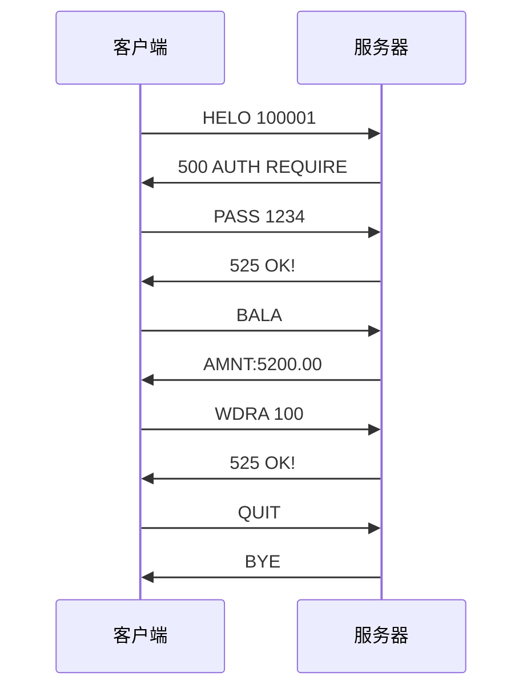
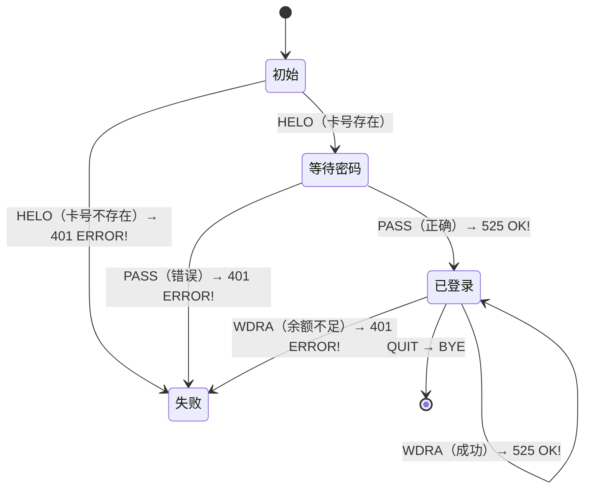

# ATM 银行系统 — 使用指南

## 项目简介

基于 **TCP Socket** 的 ATM 客户端-服务器程序。服务器模拟银行后台，支持多客户端并发连接；客户端模拟 ATM 终端，通过命令行与服务器交互。

通信协议遵循 **RFC-20242024**。

---

## 文件清单

| 文件 | 说明 |
|------|------|
| `ATMServer.java` | 银行服务器端程序 |
| `ATMClient.java` | ATM 客户端程序 |
| `users.txt` | 用户卡号与密码数据 |
| `balances.txt` | 用户余额数据（取款后会自动写回） |

---

## 环境要求

- **JDK 8** 或更高版本
- 操作系统：Windows / Linux / macOS

---

## 快速开始

### 1. 编译

在项目目录下执行：

```bash
javac ATMServer.java ATMClient.java
```

### 2. 启动服务器

```bash
java ATMServer
```

默认监听端口 **2525**。指定端口：

```bash
java ATMServer 8888
```

> 端口范围：1024 ~ 65535

启动成功示例：

```
ATM服务器已启动，监听端口 2525
```

### 3. 启动客户端

打开**新终端**，进入同一目录：

```bash
java ATMClient
```

默认连接 `127.0.0.1:2525`。连接远程服务器：

```bash
java ATMClient 192.168.1.100 2525
```

---

## 操作演示

```
已连接到ATM服务器 127.0.0.1:2525
请输入卡号: 100001
服务器要求验证口令: 500 AUTH REQUIRE
请输入口令: 1234
认证成功！

可选操作: BALA(查询余额)  WDRA <金额>  QUIT(退出)
> BALA
当前余额: 5200.00 元

可选操作: BALA(查询余额)  WDRA <金额>  QUIT(退出)
> WDRA 100
操作成功！

可选操作: BALA(查询余额)  WDRA <金额>  QUIT(退出)
> QUIT
服务器已结束会话，感谢使用。
```

客户端在控制台直接输入协议命令（如 `BALA`、`WDRA 100`、`QUIT`），中文提示仅为本地界面展示，不影响底层报文格式。

---

## 预置账户

| 卡号 | 密码 | 当前余额（balances.txt） |
|------|------|--------------------------|
| 100001 | 1234 | 5200.00 |
| 100002 | 1111 | 1300.50 |
| 100003 | 0721 | 6000.00 |

---

## 通信协议（RFC-20242024）

### 客户端 → 服务器

| 命令 | 格式 | 说明 |
|------|------|------|
| HELO | `HELO <卡号>` | 插卡，提交卡号 |
| PASS | `PASS <密码>` | 提交口令进行验证 |
| BALA | `BALA` | 查询当前余额 |
| WDRA | `WDRA <金额>` | 取款，金额单位为元（整数或小数） |
| QUIT | `QUIT` | 结束会话并退出 |

> 命令与参数之间用**空格**分隔。

### 服务器 → 客户端

| 响应 | 含义 |
|------|------|
| `500 AUTH REQUIRE` | 收到 HELO 后，要求客户端发送 PASS |
| `525 OK!` | 操作成功（口令验证通过、取款成功等） |
| `401 ERROR!` | 操作失败（口令错误、余额不足、未认证等） |
| `AMNT:<金额>` | BALA 的响应，冒号后紧跟数值，无空格 |
| `BYE` | 会话正常结束，连接将关闭 |

### 交互流程



### 状态机



---

## 典型测试用例

| # | 操作 | 预期服务器响应 |
|---|------|----------------|
| 1 | `HELO 100001` | `500 AUTH REQUIRE` |
| 2 | `HELO 999999`（不存在） | `401 ERROR!` |
| 3 | `PASS 1234`（正确口令） | `525 OK!` |
| 4 | `PASS 0000`（错误口令） | `401 ERROR!` |
| 5 | 已登录后发 `BALA` | `AMNT:5200.00` |
| 6 | 未登录直接发 `BALA` | `401 ERROR!` |
| 7 | `WDRA 100`（余额充足） | `525 OK!` |
| 8 | `WDRA 99999`（余额不足） | `401 ERROR!` |
| 9 | `WDRA -50`（非法金额） | `401 ERROR!` |
| 10 | `QUIT` | `BYE` |

---

## 局域网联机测试

两台主机需在同一局域网内。

| 角色 | 操作 |
|------|------|
| 主机 A（服务器） | `java ATMServer` |
| 主机 B（客户端） | `java ATMClient <A的IP地址> 2525` |

查看本机 IP：

- Windows：`ipconfig`
- Linux / macOS：`ifconfig` 或 `ip addr`

若客户端无法连接，在服务器主机上以管理员身份放行防火墙端口：

```bash
netsh advfirewall firewall add rule name="ATM Server" dir=in action=allow protocol=TCP localport=2525
```

---

## 技术要点

- **并发处理**：`ExecutorService` 线程池，每个客户端连接独立线程
- **线程安全**：`ConcurrentHashMap` 存储用户数据，`synchronized` 保护余额文件写入
- **I/O 模型**：`BufferedReader` / `PrintWriter` 按行收发报文
- **资源管理**：try-with-resources 自动关闭 Socket 与 I/O 流
- **状态机**：服务端维护 `currentCard` 与 `authenticated` 驱动命令处理

---

## 数据文件格式

**users.txt**（卡号 空格 密码，每行一条）：

```
100001 1234
100002 1111
```

**balances.txt**（卡号 空格 余额，每行一条）：

```
100001 5200.00
100002 1300.50
```

取款成功后，服务器会将最新余额写回 `balances.txt`。
